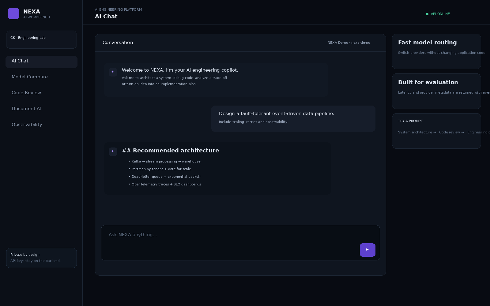

# NEXA AI Workbench

> **An interview-ready AI engineering platform for multi-model experimentation, document intelligence, code review, and prompt evaluation.**



## Why this project stands out

NEXA is intentionally more than a chatbot UI. It is a small AI platform with a production-style separation between frontend, API, model providers, and application features.

### Features

- **Multi-model gateway** — switch between Gemini and OpenAI-compatible providers from one UI.
- **AI Chat** — persistent in-memory conversation state with system instructions.
- **Model Compare** — send one prompt to two models and compare latency/output.
- **Document Intelligence** — upload a text/markdown file and ask questions against extracted context.
- **Code Review Lab** — submit code and receive structured engineering feedback.
- **Prompt Lab** — save/test reusable prompts.
- **Usage Dashboard** — request count, latency, active provider, and feature metrics.
- **Demo mode** — works without an API key using a deterministic local response.
- **Responsive frontend** — polished dark SaaS interface designed for an interviewer demo.
- **Docker-ready** — frontend and FastAPI backend can run as separate services.
- **Health endpoint** — `/api/health` makes deployment/debugging easy.

## Architecture

```text
Browser
  |
  v
React/Vite frontend
  |
  | REST / JSON
  v
FastAPI API
  |
  +--> AI Provider Gateway
  |      +--> Gemini
  |      +--> OpenAI-compatible API
  |      +--> Demo provider
  |
  +--> Feature services
         +--> Chat
         +--> Compare
         +--> Document Q&A
         +--> Code Review
         +--> Metrics
```

## Tech stack

**Frontend:** React, Vite, CSS, Lucide icons  
**Backend:** Python, FastAPI, Pydantic  
**AI:** Gemini API / OpenAI-compatible API  
**Deployment:** Docker / Docker Compose  
**Engineering:** provider abstraction, validation, health checks, environment configuration

## Run locally

### 1. Backend

```powershell
cd backend
python -m venv .venv
.\.venv\Scripts\Activate.ps1
pip install -r requirements.txt
copy .env.example .env
python -m uvicorn main:app --reload --port 8000
```

### 2. Frontend

Open a second terminal:

```powershell
cd frontend
npm install
npm run dev
```

Open the Vite URL shown in the terminal.

### API keys

Copy `.env.example` to `.env`.

```env
GEMINI_API_KEY=
OPENAI_API_KEY=
OPENAI_BASE_URL=https://api.openai.com/v1
```

If no key is configured, NEXA automatically uses **Demo Mode**, so the interface remains fully testable.

## API endpoints

| Method | Endpoint | Purpose |
|---|---|---|
| GET | `/api/health` | Service health |
| GET | `/api/models` | Available providers/models |
| POST | `/api/chat` | AI chat |
| POST | `/api/compare` | Compare two model configurations |
| POST | `/api/code-review` | Engineering code review |
| POST | `/api/document/ask` | Ask against uploaded text |
| GET | `/api/metrics` | Dashboard metrics |

## Interview demo flow

1. Start the backend and frontend.
2. Open **Chat** and ask: `Design a scalable event-driven data pipeline.`
3. Open **Compare** and run the same prompt through two providers.
4. Open **Code Review** and paste a deliberately inefficient Python function.
5. Open **Document AI** and upload a README/specification.
6. Open **Observability** to show latency/request metrics.
7. Explain the provider abstraction and why API keys never live in the frontend.

## Engineering decisions worth discussing

- **Why a provider gateway?** It prevents the UI from being coupled to one AI vendor.
- **Why FastAPI?** Strong request validation, typed APIs, async support, and easy deployment.
- **Why demo mode?** Interviewers can run the project without exposing credentials.
- **Why separate frontend/backend?** Clear security boundary: secrets stay server-side.
- **How would you scale it?** Redis for sessions/rate limiting, PostgreSQL for persistence, object storage for documents, a queue for long-running jobs, tracing, and model-level cost controls.

## GitHub checklist

- [x] Professional README
- [x] Architecture diagram
- [x] Product screenshot
- [x] Frontend + backend
- [x] Docker support
- [x] Environment template
- [x] Health check
- [x] API documentation
- [x] Interview demo path
- [x] No API secrets committed

## License

MIT
